```mermaid
gantt
    title Roadmap Pengerjaan MVP CS Umroh Copilot
    dateFormat  X
    axisFormat %d
    section Fondasi
    Sprint 0 - Setup Database & Data Engine     :0, 1
    Sprint 1 - Auth & Base Layout Monochrome   :1, 2
    section Admin
    Sprint 2 - Super Admin Multi-Brand CRUD    :2, 3
    section CS Core
    Sprint 3 - Copilot Chat & Quick Copy       :3, 4
    Sprint 4 - Mini Lead Tracker (Pipeline)    :4, 5
    section Edukasi & QA
    Sprint 5 - LMS Belajar Mandiri             :5, 6
    Sprint 6 - Integration Test & Split-Screen :6, 7
```

# SPRINT PLAN: CS UMROH COPILOT & LMS
## Minimum Viable Product (MVP) - Multi-Brand Edition

Dokumen ini membagi pengerjaan sistem menjadi **6 Sprint bertahap** yang terstruktur, fokus pada penyelesaian fungsi inti (*high-impact*), dan siap diuji coba secara lokal di Laragon.

---

---

## 🎯 Sprint 0: Setup Database, Multi-Brand Schema & Data Engine

### Target:
Mempersiapkan infrastruktur database MySQL di Laragon dan service pembaca bank skrip JSON dengan transformasi POV CS.

### Task List:
- [x] Buat file konfigurasi koneksi `config/db.php`:
  - PDO MySQL ke `localhost:3306`, user `root`, pass `""`.
  - Auto-create database `csumroh` dan 4 tabel utama (`brands`, `users`, `packages`, `prospects`).
- [x] Buat database seeder otomatis:
  - 5 Brand Travel perusahaan (nama brand, izin PPIU, data rekening resmi).
  - 1 Akun Super Admin default (`admin@csumroh.com` / `admin123`).
  - 1 Akun CS Azhan default (`azhan@csumroh.com` / `azhan123`, terikat ke Brand 1).
  - Data contoh paket umroh per brand.
- [x] Buat engine pembaca JSON `data/scripts_loader.php`:
  - Membaca aman 11 file di `conversion-chat/` dan `scripts-chat/`.
  - Transformasi otomatis teks: ubah narasi *agen lapangan* $\rightarrow$ *CS resmi travel* (`{{agent_name}}` $\rightarrow$ `{{cs_name}}`).

### Kriteria Selesai (DoD):
- [x] Database `csumroh` dan tabel terbentuk di MySQL Laragon.
- [x] Service script loader dapat me-return data array JSON yang bersih dan siap dipakai.

---

## 🔐 Sprint 1: Autentikasi & Shell Layout Monochrome

### Target:
Sistem login aman dengan pemisahan peran (Super Admin vs CS) dan kerangka antarmuka hitam-putih (monochrome).

### Task List:
- [x] Buat modul autentikasi:
  - `auth/login.php`: Tampilan form login minimalis netral hitam-putih & pemrosesan session.
  - `auth/logout.php`: Destroy session dan redirect.
  - `includes/auth_check.php`: Middleware/guard untuk validasi sesi dan proteksi role.
- [x] Buat komponen template global:
  - `includes/header.php`: Navigasi atas monochrome, penanda brand aktif, info nama user login, tombol logout.
  - `includes/footer.php`: Asset loader (Tailwind CDN, Alpine.js CDN) dan toast notification container.

### Kriteria Selesai (DoD):
- [x] User bisa login sebagai Super Admin (diarahkan ke Admin Panel) atau sebagai CS (diarahkan ke CS Workspace).
- [x] Akses halaman terproteksi dengan benar sesuai role.

---

## 👑 Sprint 2: Super Admin Multi-Brand Panel

### Target:
Super Admin dapat mengelola 5 Brand Travel, Paket Umroh per Brand, dan Akun CS.

### Task List:
- [x] Buat `admin/brands.php`:
  - List & Edit 5 Brand Travel perusahaan.
  - Input Nomor PPIU Kemenag, Nama Bank, No. Rekening Transfer DP, dan Atas Nama PT.
- [x] Buat `admin/packages.php`:
  - CRUD Paket Umroh dengan memilih Brand pemilik paket.
  - Input detail paket: nama, harga, DP, maskapai, hotel Makkah/Madinah, jadwal, fasilitas.
- [x] Buat `admin/users.php`:
  - CRUD Akun CS.
  - Menugaskan akun CS ke salah satu Brand Travel (`brand_id`).

### Kriteria Selesai (DoD):
- [x] Super Admin bisa menambah paket umroh baru yang langsung terasosiasi ke brand tertentu.
- [x] Super Admin bisa membuat CS baru dan menentukan brand yang dipegangnya.

---

## ⚡ Sprint 3: CS Copilot Chat & Smart Script Copier (Core Value)

### Target:
Menghadirkan asisten salin cepat skrip untuk CS Azhan dengan auto-replace variabel brand/prospek dan panduan TGJP.

### Task List:
- [x] Bangun bar variabel cepat di bagian atas `index.php`:
  - Info Brand (otomatis sesuai brand CS yang login).
  - Nama CS (otomatis terisi nama user).
  - Input Cepat Nama Calon Jamaah (`{{nama}}`).
  - Dropdown Pilihan Paket Umroh (otomatis difilter hanya paket milik brand CS).
- [x] Tampilkan tab 6 tahapan percakapan konversi:
  1. Greeting
  2. Identifikasi Kebutuhan (NPGD)
  3. Penawaran Paket (MRBVA)
  4. Closing & Booking DP (CRA)
  5. Penanganan Keberatan (TGJP)
  6. Follow-up
- [x] Implementasikan pencarian instan skrip & tombol **1-Klik Salin** (Alpine.js):
  - Placeholder otomatis tergantikan dengan data riil (termasuk nomor rekening resmi saat closing).
  - Feedback visual toast *"Tersalin ke Clipboard!"*.
- [x] Buat Wizard Interaktif Penanganan Keberatan (**TGJP**):
  - Step 1: Terima $\rightarrow$ Step 2: Gali $\rightarrow$ Step 3: Jawab $\rightarrow$ Step 4: Pastikan.

### Kriteria Selesai (DoD):
- [x] CS Azhan bisa mengetik nama calon jamaah dan menyalin skrip apa pun dalam 1 klik tanpa placeholder yang bocor.
- [x] Nomor rekening dan nama travel yang tersalin 100% akurat sesuai brand CS.

---

## 📋 Sprint 4: Mini Lead Tracker (Pencatatan Prospek CS)

### Target:
Pencatatan calon jamaah harian yang terintegrasi langsung dengan Copilot Chat.

### Task List:
- [x] Buat form input prospek cepat:
  - Nama, No. WhatsApp, Pilihan Paket, Status (9 status), Catatan NPGD, Tanggal Follow-up.
- [x] Tampilkan tabel ringkas prospek aktif:
  - Tombol langsung buka chat WhatsApp: `https://wa.me/628xxx`.
  - Tombol **"Muat ke Copilot"**: 1-klik mengisi nama dan paket prospek ke Copilot Chat.
  - Update status prospek cepat (*New, Offered, Objection, Closing, Won, Lost, Nurture*).
- [x] Filter prospek per CS dan Brand.

### Kriteria Selesai (DoD):
- [x] Prospek tersimpan ke database MySQL.
- [x] CS bisa berpindah dari daftar prospek ke Copilot Chat secara instan.

---

## 🎓 Sprint 5: LMS Belajar Mandiri CS (Online Course View)

### Target:
Antarmuka e-learning mandiri bagi CS untuk mempelajari SOP konversi umroh.

### Task List:
- [x] Buat halaman `lms/index.php`:
  - Layout LMS modern: Sidebar kurikulum di kiri, kanvas materi pelajaran di kanan.
- [x] Sajikan 8 Modul Pembelajaran dari `conversion-cycle.json`:
  - Modul 1: Pengantar Umroh Conversion Cycle & Filosofi Sales
  - Modul 2: Stage 1 - Greeting & Sell Yourself
  - Modul 3: Stage 2 - Prospect Identification & Framework NPGD
  - Modul 4: Stage 3 - Crafting Offers & Formula MRBVA
  - Modul 5: Stage 4 - Closing & Formula CRA
  - Modul 6: Stage 5 - Handling Objection & Framework TGJP
  - Modul 7: Stage 6 - Follow-up & Formula CCN
  - Modul 8: Kamus 9 Status Prospek & Siklus Pipeline
  - Modul 9: Kode Etik CS Umroh & Anti-Overpromise
- [x] Tambahkan elemen interaktif:
  - Komparasi *Chat Kurang Tepat* vs *Chat Standar SOP*.
  - Checklist pemahaman mandiri & tombol navigasi modul.

### Kriteria Selesai (DoD):
- [x] CS bisa membaca dan mempelajari SOP secara interaktif layaknya di platform LMS online.

---

## 🧪 Sprint 6: Testing Integrasi, Split-Screen & Handover

### Target:
Uji coba menyeluruh dalam kondisi operasional harian.

### Task List:
- [x] Uji coba split-screen: memastikan layout responsif pada lebar 50% layar monitor di samping WhatsApp Web.
- [x] Uji coba isolasi brand: pastikan CS Brand A tidak bisa melihat atau salah menyalin rekening Brand B.
- [x] Uji coba copy-paste ke WhatsApp Web nyata.
- [x] Pembuatan panduan ringkas penggunaan (*Quick Start Guide*) untuk CS Azhan (`README.md`).

### Kriteria Selesai (DoD):
- [x] Seluruh sistem berjalan lokal di Laragon pada `http://localhost/csumroh` dan `http://csumroh.test:8080`.
- [x] Dokumentasi dan alur kerja CS teruji siap pakai.

---

## Status Eksekusi

Saat ini seluruh rencana di atas telah siap. Sesuai kesepakatan, **eksekusi koding belum dijalankan** sampai ada instruksi eksplisit dari Anda.

